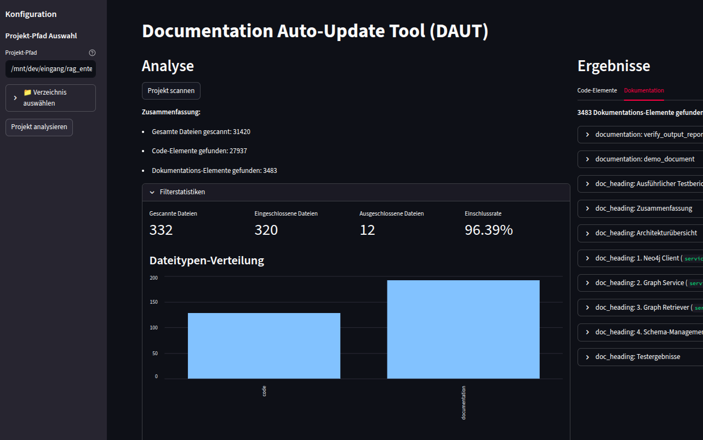
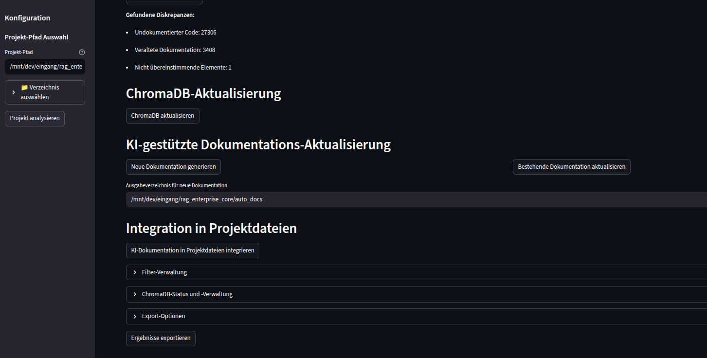
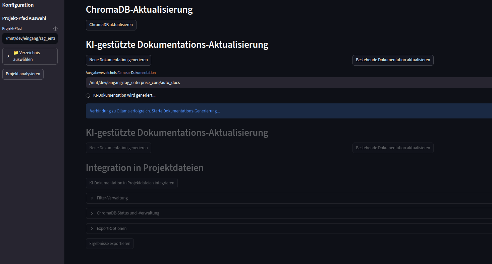
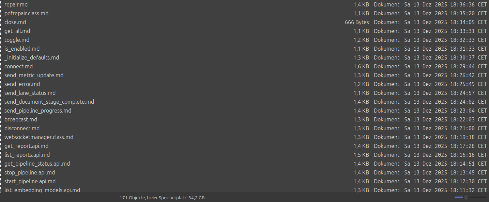

# 📚 DAUT - Documentation Auto-Update Tool

> **AI-powered documentation generator that keeps your docs in sync with your code**

[](https://www.python.org/downloads/)
[](https://opensource.org/licenses/MIT)
[](https://streamlit.io)

DAUT scans your codebase, detects undocumented code, and automatically generates comprehensive documentation using LLM (Ollama). Perfect for maintaining up-to-date API docs, class references, and function documentation across Python, JavaScript, and TypeScript projects.

## ✨ Features

- 🔍 **Universal Code Scanner** - Detects functions, classes, API endpoints across Python, JS, TS
- 🤖 **AI Documentation Generation** - Uses Ollama to generate human-readable docs
- 📊 **Live Progress Tracking** - Real-time progress bars and statistics
- 🎯 **Smart File Detection** - Respects .gitignore, skips venv/node_modules automatically
- 💾 **ChromaDB Integration** - Semantic search and context-aware documentation
- ⚡ **Resume Support** - Skip already-generated docs, continue where you left off
- 🎨 **Beautiful UI** - Streamlit-based interface + powerful CLI

## 🚀 Quick Start

### Installation

```bash
# Clone and setup
git clone <your-repo>
cd doc_updater_app
python -m venv venv
source venv/bin/activate  # Windows: venv\Scripts\activate
pip install -r requirements.txt
```

### Generate Docs in 3 Steps

```bash
# Launch UI
streamlit run src/ui/main.py
```

1. **Select Project** → Browse to your codebase
2. **Scan** → Analyze code and find undocumented elements
3. **Generate** → AI creates comprehensive docs

**CLI Mode:**
```bash
python -m src.docs_updater /path/to/project
```

## 📸 Screenshots

### Scan Progress


### Analysis Dashboard


### AI Documentation Generation


### Generated Documentation Files


### Documentation Files Overview


## 🎯 Use Cases

- **API Documentation** - Auto-generate REST API endpoint docs
- **Code Onboarding** - Help new developers understand your codebase
- **Documentation Audits** - Find and fix documentation gaps
- **Legacy Code** - Document undocumented legacy systems
- **Continuous Docs** - Keep docs in sync with code changes

## 📋 Example Output

**Input:** Python function
```python
def get_session(session_id: str):
    """Retrieve session history."""
    return db.query(session_id)
```

**Generated Documentation:**
```markdown
## get_session

### Description
The `get_session` API endpoint retrieves the conversation history for
a specific session. Requires permission to view session history.

### Parameters
| Name | Type | Default |
|------|------|---------|
| session_id | str | None |

### Return Value
Returns the session history including session ID and message list.

### Example
```bash
GET /sessions/12345
```

### Error Handling
Returns 500 on errors, 403 if permission denied.
```

## 🏗️ Architecture

```
doc_updater_app/
├── src/
│   ├── core/          # Config management, project analysis
│   ├── scanner/       # Code & documentation scanners
│   ├── matcher/       # Discrepancy detection
│   ├── llm/          # Ollama integration
│   ├── chroma/       # ChromaDB vector store
│   ├── updater/      # Documentation update engine
│   └── ui/           # Streamlit interface
├── requirements.txt
└── setup.py
```

## 🔧 Configuration

**service_config.json:**
```json
{
  "ollama_host": "http://localhost:11434",
  "chroma_host": "localhost",
  "chroma_port": 8000,
  "ollama_timeout": 120
}
```

## 🛠️ Requirements

- **Python 3.9+**
- **Ollama** (optional, for AI generation)
  ```bash
  # Install: https://ollama.ai
  ollama pull llama3
  ```
- **ChromaDB** (optional, for semantic search)
  ```bash
  pip install chromadb
  chroma run --path ./chromadb_data --port 8000
  ```

## 📚 Supported Languages & Formats

**Code:**
- Python (`.py`)
- JavaScript/TypeScript (`.js`, `.ts`, `.tsx`, `.jsx`)

**Documentation:**
- Markdown (`.md`)
- reStructuredText (`.rst`)
- Plain text (`.txt`)

## 🎨 Features in Detail

### Smart Progress Tracking
```
🔍 Scanning: [45/1234] 3.6% - api_service.py

[1/150] Verarbeite: get_session (api_endpoint)
    ✅ Gespeichert: get_session.api.md
[2/150] Verarbeite: delete_session (api_endpoint)
    ⏭️  Übersprungen (existiert): delete_session.api.md
```

### Resume Support
Stop and restart anytime - already generated docs are automatically skipped!

### Diskrepanz Analysis
- **Undocumented Code** - Functions/classes without docs
- **Outdated Documentation** - Docs that don't match current code
- **Mismatched Elements** - Signature changes, parameter updates

## 🤝 Contributing

Contributions welcome! This project is under active development.

## 📄 License

MIT License - see LICENSE file for details

## 🙏 Acknowledgments

- Built with [Streamlit](https://streamlit.io)
- Powered by [Ollama](https://ollama.ai)
- Vector search via [ChromaDB](https://www.trychroma.com)

## 🚦 Project Status

**Current Version:** 1.0.0 (Stable)

All core features implemented:
- ✅ Universal code scanning
- ✅ AI documentation generation
- ✅ Progress tracking and resume support
- ✅ ChromaDB integration
- ✅ Streamlit UI + CLI

## 📞 Support

Found a bug or have a feature request? Open an issue!

---

**Made with ❤️ for developers who love good documentation**
