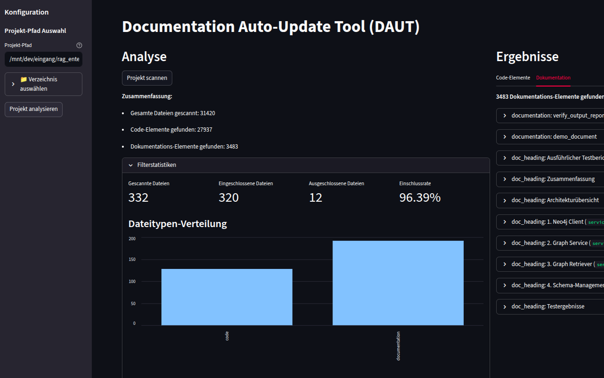
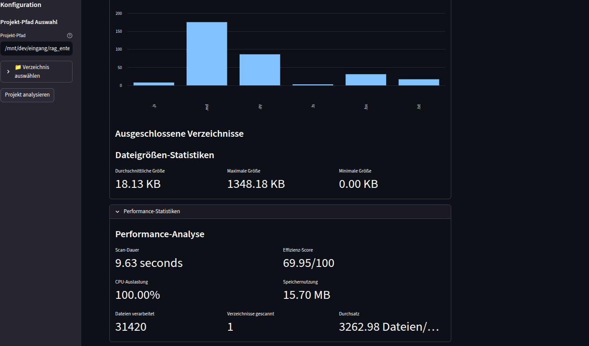
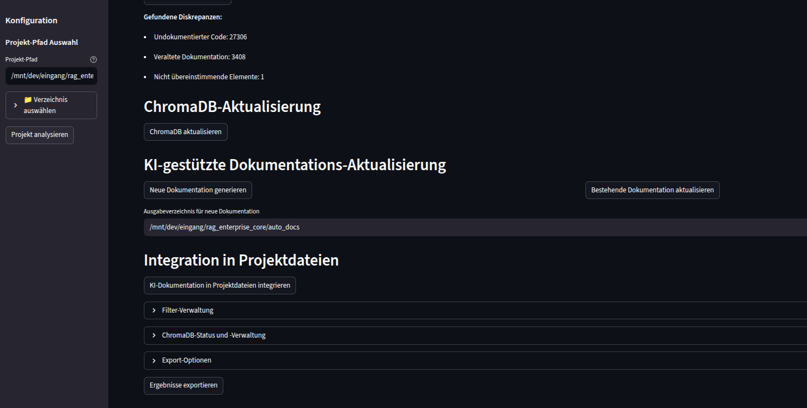
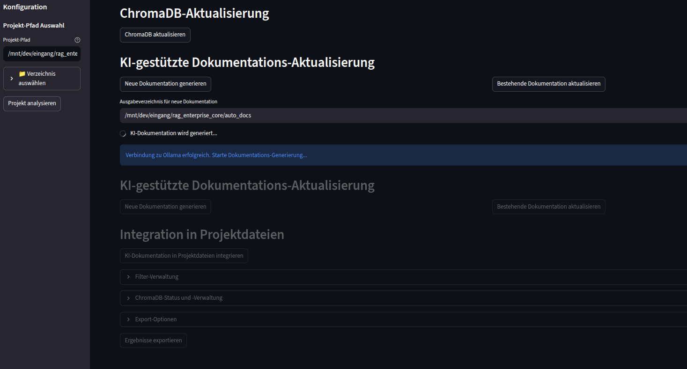
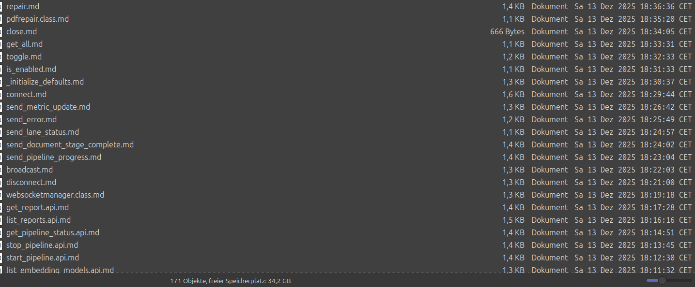
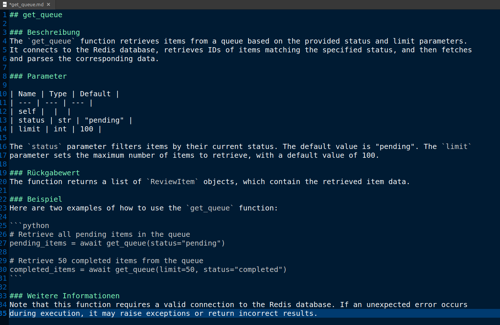

⚠️ IMPORTANT NOTICE REGARDING PLAGIARISM & AUTHORSHIP ⚠️ 


It has come to my attention that the GitHub user @tfantas (Thiago Antas) and his automated account @jarvis-aix are falsely claiming credit for my architecture.
They have explicitly listed my original repositories (including RAG_enterprise_core, smart-ingest-kit, DAUT, etc.) as their own '🔬 Featured Work' on their public 
profile without authorization or proper attribution. Below is the documented proof.


https://github.com/tfantas  seems to have 20+ years of expirience but no own ideas .... Im gonna make him famous...... 
If you enjoyed my repos and found them useful, Im sorry but im out of this game !!! No more opensource Sorry
Im sure you will find my further developed Repos at https://github.com/jarvis-aix  .... What a disgrace and disrespect !

This repository, the Multi-Lane Consensus Architecture, and the V4.0 Manifest are 100% my original work, built over two years. 
Please be highly cautious of actors in the AI space attempting to rebrand, clone, or take credit for this Enterprise RAG system

⚠️ ⚠️ ⚠️ 


# 📚 DAUT - Documentation Auto-Update Tool

> **AI-powered documentation generator that keeps your docs in sync with your code**

[](https://www.python.org/downloads/)
[](https://opensource.org/licenses/MIT)
[](https://streamlit.io)

DAUT scans your codebase, detects undocumented code, and automatically generates comprehensive documentation using LLM (Ollama). Perfect for maintaining up-to-date API docs, class references, and function documentation across Python, JavaScript, and TypeScript projects.

## ✨ Features

- 🔍 **Universal Code Scanner** - Detects functions, classes, API endpoints across Python, JS, TS
- 🤖 **AI Documentation Generation** - Uses Ollama to generate human-readable docs
- 📊 **Live Progress Tracking** - Real-time progress bars and statistics
- 🎯 **Smart File Detection** - Respects .gitignore, skips venv/node_modules automatically
- 💾 **ChromaDB Integration** - Semantic search and context-aware documentation
- ⚡ **Resume Support** - Skip already-generated docs, continue where you left off
- 🔌 **MCP Server** - Expose RAG capabilities to external agents (Claude, Cursor, etc.)
- 🎨 **Beautiful UI** - Streamlit-based interface + powerful CLI

## 🧠 RAG Strategy (Under the Hood)

DAUT uses a sophisticated **structural indexing approach** to ensure high-quality answers:

1.  **Unified Knowledge Base** 🌐
    All files, regardless of their folder depth, are indexed into a single project-wide collection (e.g., `rag_enterprise_core_code`). This prevents context fragmentation and ensures the AI sees the "Big Picture".

2.  **Full-Content Embedding** 📖
    Unlike simple splitters that chop text into arbitrary chunks, DAUT indexes the **full content** of your documentation files. This preserves the complete context of tutorials and guides.

3.  **Structure-Aware Code Indexing** 🏗️
    Code is not just text. We parse the AST (Abstract Syntax Tree) to treat Classes, Functions, and API Endpoints as distinct semantic entities.

## 🚀 Quick Start

### Installation

```bash
# Clone and setup
git clone <your-repo>
cd doc_updater_app
python -m venv venv
source venv/bin/activate  # Windows: venv\Scripts\activate
pip install -r requirements.txt
```

### Generate Docs in 3 Steps

```bash
# Launch UI
streamlit run src/ui/main.py
```

1. **Select Project** → Browse to your codebase
2. **Scan** → Analyze code and find undocumented elements
3. **Generate** → AI creates comprehensive docs

**CLI Mode:**
```bash
python -m src.docs_updater /path/to/project
```

## 📸 Screenshots

### Scan Progress


### Analysis Dashboard


### AI Documentation Generation


### Generated Documentation Files


### Documentation Files Overview




## 🎯 Use Cases

- **API Documentation** - Auto-generate REST API endpoint docs
- **Code Onboarding** - Help new developers understand your codebase
- **Documentation Audits** - Find and fix documentation gaps
- **Legacy Code** - Document undocumented legacy systems
- **Continuous Docs** - Keep docs in sync with code changes

## 💡 Best Practices

### Ensure High-Quality RAG Results
To avoid "diluting" the AI's knowledge base with outdated information:
*   **Prioritize `auto_docs`**: These files are generated directly from the current codebase and represent the "source of truth".
*   **Exclude Legacy Docs**: If you have an old `docs/` folder with manual (potentially outdated) documentation, consider adding `docs/` to the **Exclude Patterns** in the **Filter Management** sidebar.
*   **Why?** If the RAG system indexes both current code (via `auto_docs`) and outdated manuals (via `docs/`), it might retrieve conflicting information. By filtering out legacy docs, you ensure a "Pure Code-Truth" knowledge base.

## 📋 Example Output

**Input:** Python function
```python
def get_session(session_id: str):
    """Retrieve session history."""
    return db.query(session_id)
```

**Generated Documentation:**
```markdown
## get_session

### Description
The `get_session` API endpoint retrieves the conversation history for
a specific session. Requires permission to view session history.

### Parameters
| Name | Type | Default |
|------|------|---------|
| session_id | str | None |

### Return Value
Returns the session history including session ID and message list.

### Example
```bash
GET /sessions/12345
```

### Error Handling
Returns 500 on errors, 403 if permission denied.
```

## 🏗️ Architecture

```
doc_updater_app/
├── src/
│   ├── core/          # Config management, project analysis
│   ├── scanner/       # Code & documentation scanners
│   ├── matcher/       # Discrepancy detection
│   ├── llm/          # Ollama integration
│   ├── chroma/       # ChromaDB vector store
│   ├── updater/      # Documentation update engine
│   └── ui/           # Streamlit interface
├── requirements.txt
└── setup.py
```

## 🔧 Configuration

**service_config.json:**
```json
{
  "ollama_host": "http://localhost:11434",
  "chroma_host": "localhost",
  "chroma_port": 8000,
  "ollama_timeout": 120
}
```

## 🛠️ Requirements

- **Python 3.9+**
- **Ollama** (optional, for AI generation)
  ```bash
  # Install: https://ollama.ai
  ollama pull llama3
  ```
- **ChromaDB** (optional, for semantic search)
  ```bash
  pip install chromadb
  chroma run --path ./chromadb_data --port 8000
  ```

## 📚 Supported Languages & Formats

**Code:**
- Python (`.py`)
- JavaScript/TypeScript (`.js`, `.ts`, `.tsx`, `.jsx`)

**Documentation:**
- Markdown (`.md`)
- reStructuredText (`.rst`)
- Plain text (`.txt`)

## 🎨 Features in Detail

### Smart Progress Tracking
```
🔍 Scanning: [45/1234] 3.6% - api_service.py

[1/150] Verarbeite: get_session (api_endpoint)
    ✅ Gespeichert: get_session.api.md
[2/150] Verarbeite: delete_session (api_endpoint)
    ⏭️  Übersprungen (existiert): delete_session.api.md
```

### Resume Support
Stop and restart anytime - already generated docs are automatically skipped!

### Diskrepanz Analysis
- **Undocumented Code** - Functions/classes without docs
- **Outdated Documentation** - Docs that don't match current code
- **Mismatched Elements** - Signature changes, parameter updates

- **Mismatched Elements** - Signature changes, parameter updates

## 🔌 MCP Server Integration

DAUT includes a **Model Context Protocol (MCP)** server, allowing you to connect external AI agents (like Claude Desktop, Cursor, or other LLMs) directly to your project's knowledge base.

### Features
- **Secure Access**: Protected via API Key (Bearer Token).
- **RAG Tools**:
  - `query_rag(query)`: Semantic search in your code and documentation.
  - `read_documentation_file(path)`: Read full content of generated docs.
  - `list_documentation_files()`: List available documentation.
- **Monitoring**: Live connection tracking via the Web UI.

### 🚀 Usage

**Manual Start:**
```bash
# Start the server (Default port: 8001)
./start_mcp.sh
```

**Auto-Start (Systemd):**
Run as a background service that survives reboots:
```bash
chmod +x install_service.sh
sudo ./install_service.sh
```

### 🔐 Security & Configuration

The server requires an **API Key** for all requests. You **MUST** configure this to secure your data.

**Setting the API Key:**
1.  Edit `start_mcp.sh` (for manual start) or `daut-mcp.service` (for systemd).
2.  Change the `MCP_API_KEY` variable:
    ```bash
    export MCP_API_KEY="your-secure-password-here"
    ```
3.  Restart the server.

**Environment Variables:**
| Variable | Default | Description |
|----------|---------|-------------|
| `MCP_PORT` | `8001` | Port for the MCP SSE endpoint |
| `MCP_HOST` | `0.0.0.0` | Bind address |
| `MCP_API_KEY` | `secret-token-123` | **REQUIRED:** Auth token for clients |

**Connect a Client:**
- **URL**: `http://<your-server-ip>:8001/mcp/sse`
- **Auth**: Header `Authorization: Bearer <your-key>`

## 🤝 Contributing

Contributions welcome! This project is under active development.

## 📄 License

MIT License - see LICENSE file for details

## 🙏 Acknowledgments

- Built with [Streamlit](https://streamlit.io)
- Powered by [Ollama](https://ollama.ai)
- Vector search via [ChromaDB](https://www.trychroma.com)

## 🚦 Project Status

**Current Version:** 1.0.0 (Stable)

All core features implemented:
- ✅ Universal code scanning
- ✅ AI documentation generation
- ✅ Progress tracking and resume support
- ✅ ChromaDB integration
- ✅ Streamlit UI + CLI

## 📞 Support

Found a bug or have a feature request? Open an issue!

---

**Made with ❤️ for developers who love good documentation**
